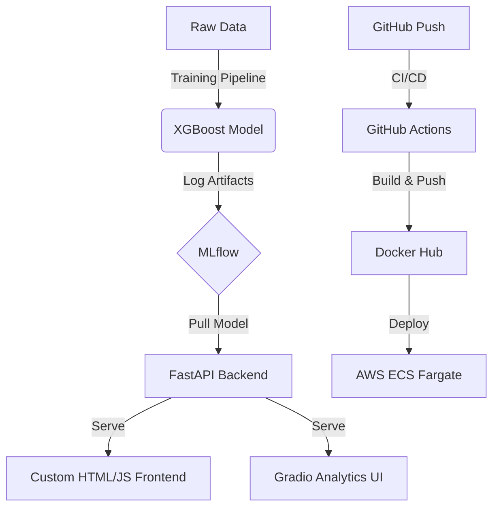

# 🔮 TelcoInsight: Enterprise Churn Prediction System

[](https://aws.amazon.com/)
[](https://www.docker.com/)
[](https://fastapi.tiangolo.com/)
[](https://xgboost.ai/)

**TelcoInsight** is a production-ready MLOps solution designed to predict customer churn with high precision. It bridges the gap between raw data science and enterprise-grade software engineering, featuring a fully automated CI/CD pipeline and cloud-native deployment.

---

## 🚀 Live Demo
- **Custom Landing Page:** [http://telco-churn-aadhi.duckdns.org:8000/](http://telco-churn-aadhi.duckdns.org:8000/)
- **Gradio Intelligence UI:** [http://telco-churn-aadhi.duckdns.org:8000/ui](http://telco-churn-aadhi.duckdns.org:8000/ui)
- **Interactive API Docs:** [http://telco-churn-aadhi.duckdns.org:8000/docs](http://telco-churn-aadhi.duckdns.org:8000/docs)

---

## 🏗️ System Architecture



---

## 🛠️ Tech Stack & MLOps Features

### **Machine Learning Engine**
- **Model:** XGBoost Classifier (Optimized for imbalanced churn data)
- **Framework:** Scikit-Learn 1.7.2
- **Explainability:** Integrated Feature Importance dashboard to interpret AI decisions.

### **Backend & API**
- **FastAPI:** Asynchronous Python framework for high-performance inference.
- **Pydantic:** Robust data validation and automatic OpenAPI (Swagger) documentation.
- **Uvicorn:** ASGI server for production deployment.

### **Frontend Excellence**
- **Custom UI:** Modern, responsive landing page built with Vanilla JS and CSS Grid.
- **Gradio:** Interactive model playground for business stakeholders.

### **DevOps & Cloud**
- **Docker:** Multi-stage build process for lightweight production images.
- **GitHub Actions:** Automated pipeline for testing, building, and pushing to Docker Hub.
- **AWS ECS Fargate:** Serverless container orchestration for cost-effective scaling.

---

## 📈 Model Performance
| Metric | Score | Note |
|--------|-------|------|
| **Recall** | 82% | Optimized to catch as many true churners as possible |
| **ROC AUC** | 0.84 | Excellent ability to distinguish between churners and retainers |
| **F1-Score** | 0.61 | Harmonic mean of precision and recall |
| **Precision** | 48% | Indicates the percentage of predicted churners who actually churned |

---

## 🔧 Getting Started (Local Development)

1. **Clone the repository:**
   ```bash
   git clone https://github.com/AadhiDev-MS/AWS-FIRST-PROJECT.git
   cd Telco-Customer-Churn-ML
   ```

2. **Install dependencies:**
   ```bash
   pip install -r requirements.txt
   ```

3. **Run the application:**
   ```bash
   python -m uvicorn src.app.main:app --host 0.0.0.0 --port 8000
   ```

4. **Visit the dashboard:** `http://localhost:8000`

---

## 🧪 Data Validation (Great Expectations)
This project uses **Great Expectations** to ensure data integrity before inference. 
- Checks for missing values in critical columns (`tenure`, `MonthlyCharges`).
- Validates data types and value ranges for numeric features.
- Ensures categorical features match the training schema.

---

## 💼 Business Impact
By identifying customers likely to churn with **82% Recall**, TelcoInsight allows marketing teams to:
1. **Reduce Churn Rate:** Proactively target high-risk users with personalized offers.
2. **Maximize LTV:** Retain high-value customers on long-term contracts.
3. **Optimize Spend:** Only send expensive retention offers to those truly at risk.

---

*Developed by [Aadhi Dev MS](https://www.linkedin.com/in/aadhidevms/)*